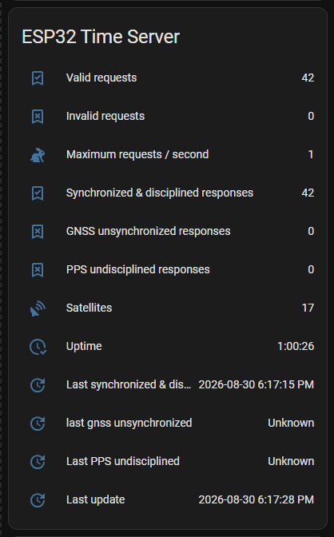
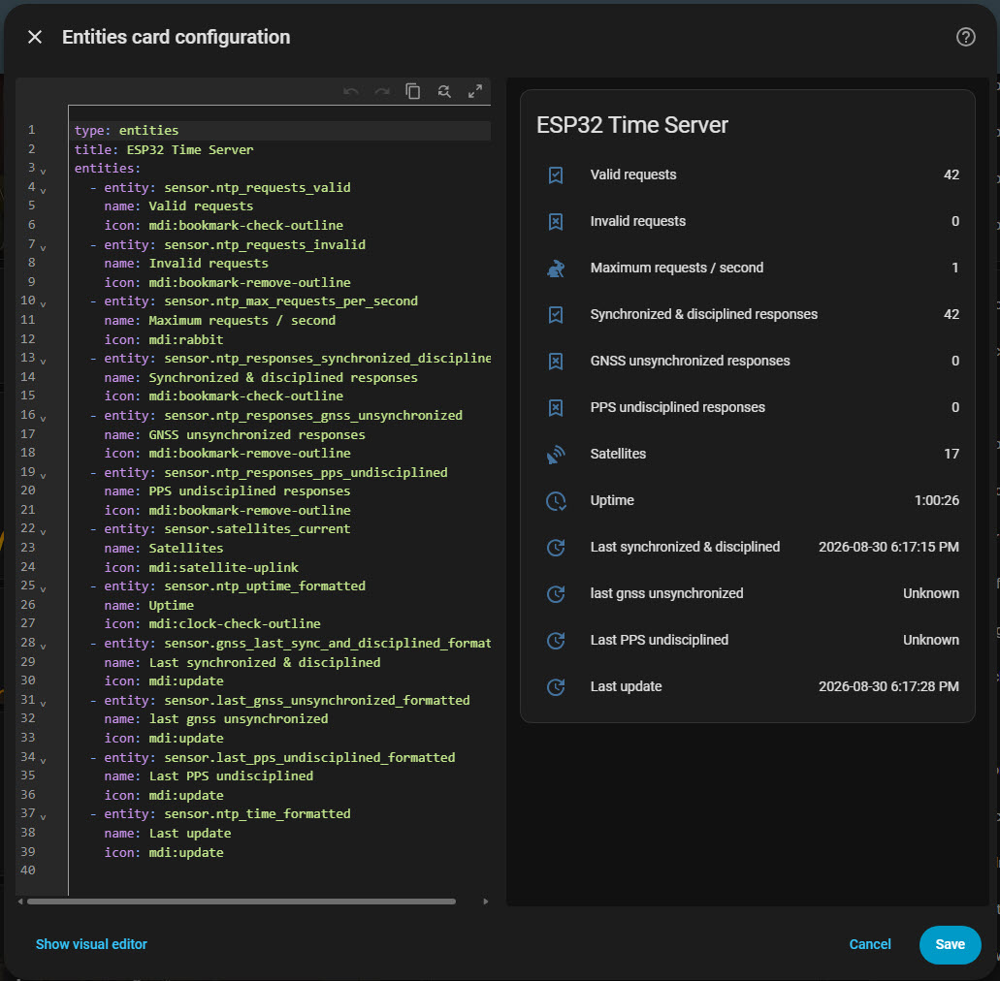

# ESP32 Time Server — Home Assistant Dashboard Card Setup

This guide covers how to integrate the ESP32 Time Server with Home Assistant and
display a status dashboard card. It is **not** an exhaustive write-up; it is
intended to get things up and running within an already existing Home Assistant
implementation.

The steps covered are:

1. Install and configure the Mosquitto MQTT broker add-on
2. Configure `mqtt.yaml` with the ESP32 Time Server sensors
3. Update `configuration.yaml` with an MQTT reference and template sensors
4. Reload the Home Assistant YAML configuration
5. Add a dashboard entity card

When complete, your dashboard will include a card like this:



---

## Step 1: Install the Mosquitto MQTT Broker

The ESP32 Time Server publishes its status data over MQTT. Home Assistant needs
a running MQTT broker to receive those messages.

The recommended broker for Home Assistant is the Mosquitto broker add-on. Follow
the official Home Assistant documentation to install and configure it before
continuing:

- **MQTT integration overview:**
  <https://www.home-assistant.io/integrations/mqtt/>
- **Mosquitto broker add-on:**
  <https://github.com/home-assistant/addons/blob/master/mosquitto/DOCS.md>

Once the Mosquitto broker is running and the MQTT integration is connected to
it, proceed to Step 2.

---

## Step 2: Configure mqtt.yaml

The MQTT sensors tell Home Assistant how to extract individual values from the
JSON payload that the ESP32 Time Server publishes to the
`ESP32TimeServer/report` topic.

Choose **one** of the three options below based on your current setup. After
completing this step, proceed to the matching option in Step 3.

### A — Create a new mqtt.yaml file

Use this option if you do **not** already have an `mqtt.yaml` file.

1. Create a new file called `mqtt.yaml` in your Home Assistant configuration
   directory (the same folder that contains `configuration.yaml`).
2. Add the following content:

<!-- markdownlint-disable MD013 -->

```yaml

  sensor:
    # ============================
    # CURRENT
    # ============================
    - name: "NTP Time"
      state_topic: "ESP32TimeServer/report"
      value_template: "{{ value_json.current.time }}"

    - name: "NTP Uptime"
      state_topic: "ESP32TimeServer/report"
      value_template: "{{ value_json.current.uptime }}"
      unit_of_measurement: "s"

    - name: "Ethernet Up"
      state_topic: "ESP32TimeServer/report"
      value_template: "{{ value_json.current.ethernet_up }}"

    - name: "GNSS Synchronized"
      state_topic: "ESP32TimeServer/report"
      value_template: "{{ value_json.current.gnss_synchronized }}"

    - name: "GNSS Locked"
      state_topic: "ESP32TimeServer/report"
      value_template: "{{ value_json.current.gnss_synchronized_indicators.locked }}"

    - name: "GNSS Timing Valid"
      state_topic: "ESP32TimeServer/report"
      value_template: "{{ value_json.current.gnss_synchronized_indicators.timing }}"

    - name: "GNSS GPS Valid"
      state_topic: "ESP32TimeServer/report"
      value_template: "{{ value_json.current.gnss_synchronized_indicators.gps_valid }}"

    - name: "GNSS Sync Fresh"
      state_topic: "ESP32TimeServer/report"
      value_template: "{{ value_json.current.gnss_synchronized_indicators.sync_fresh }}"

    - name: "GNSS Sanity Check Passed"
      state_topic: "ESP32TimeServer/report"
      value_template: "{{ value_json.current.gnss_synchronized_indicators.sanity_check_passed }}"

    - name: "PPS Disciplined"
      state_topic: "ESP32TimeServer/report"
      value_template: "{{ value_json.current.pps_disciplined }}"

    - name: "PPS Signals Present"
      state_topic: "ESP32TimeServer/report"
      value_template: "{{ value_json.current.pps_disciplined_indicators.pps_signals_present }}"

    - name: "PPS Discipline Active"
      state_topic: "ESP32TimeServer/report"
      value_template: "{{ value_json.current.pps_disciplined_indicators.discipline_active }}"

    - name: "PPS Synchronized"
      state_topic: "ESP32TimeServer/report"
      value_template: "{{ value_json.current.pps_disciplined_indicators.pps_synchronized }}"

    - name: "Satellites Current"
      state_topic: "ESP32TimeServer/report"
      value_template: "{{ value_json.current.satellites }}"

    # ============================
    # MEMORY
    # ============================
    - name: "Malloc 8-bit"
      state_topic: "ESP32TimeServer/report"
      value_template: "{{ value_json.current.memory.malloc_cap_8bit }}"

    - name: "Malloc 32-bit"
      state_topic: "ESP32TimeServer/report"
      value_template: "{{ value_json.current.memory.malloc_cap_32bit }}"

    - name: "Malloc Internal"
      state_topic: "ESP32TimeServer/report"
      value_template: "{{ value_json.current.memory.malloc_cap_internal }}"

    - name: "Malloc DMA"
      state_topic: "ESP32TimeServer/report"
      value_template: "{{ value_json.current.memory.malloc_cap_dma }}"

    - name: "Malloc SPIRAM"
      state_topic: "ESP32TimeServer/report"
      value_template: "{{ value_json.current.memory.malloc_cap_spiram }}"

    - name: "Malloc Default"
      state_topic: "ESP32TimeServer/report"
      value_template: "{{ value_json.current.memory.malloc_cap_default }}"

    - name: "Free Heap"
      state_topic: "ESP32TimeServer/report"
      value_template: "{{ value_json.current.memory.free_heap }}"

    - name: "Minimum Free Heap"
      state_topic: "ESP32TimeServer/report"
      value_template: "{{ value_json.current.memory.minimum_free_heap }}"

    - name: "Largest Free 8-bit Block"
      state_topic: "ESP32TimeServer/report"
      value_template: "{{ value_json.current.memory.largest_free_8bit_block }}"

    # ============================
    # QUEUED MESSAGES
    # ============================
    - name: "Queued Held"
      state_topic: "ESP32TimeServer/report"
      value_template: "{{ value_json.queued_messages.held }}"

    - name: "Queued Discarded"
      state_topic: "ESP32TimeServer/report"
      value_template: "{{ value_json.queued_messages.discarded }}"

    # ============================
    # THIS PERIOD
    # ============================
    - name: "Ethernet Up Seconds"
      state_topic: "ESP32TimeServer/report"
      value_template: "{{ value_json.this_period.ethernet_up_secs }}"
      unit_of_measurement: "s"

    - name: "PPS Pulses"
      state_topic: "ESP32TimeServer/report"
      value_template: "{{ value_json.this_period.pps_pulses }}"

    - name: "GNSS Locked Seconds"
      state_topic: "ESP32TimeServer/report"
      value_template: "{{ value_json.this_period.gnss_locked_secs }}"
      unit_of_measurement: "s"

    - name: "Satellites Min"
      state_topic: "ESP32TimeServer/report"
      value_template: "{{ value_json.this_period.satellites.min }}"

    - name: "Satellites Max"
      state_topic: "ESP32TimeServer/report"
      value_template: "{{ value_json.this_period.satellites.max }}"

    - name: "NTP Requests Valid"
      state_topic: "ESP32TimeServer/report"
      value_template: "{{ value_json.this_period.ntp.requests.valid }}"

    - name: "NTP Requests Invalid"
      state_topic: "ESP32TimeServer/report"
      value_template: "{{ value_json.this_period.ntp.requests.invalid }}"

    - name: "NTP Telemetry Dropped"
      state_topic: "ESP32TimeServer/report"
      value_template: "{{ value_json.this_period.ntp.requests.telemetry_dropped }}"

    - name: "NTP Max Requests Per Second"
      state_topic: "ESP32TimeServer/report"
      value_template: "{{ value_json.this_period.ntp.requests.max_per_second }}"

    - name: "NTP Responses Synchronized & Disciplined"
      state_topic: "ESP32TimeServer/report"
      value_template: "{{ value_json.this_period.ntp.responses.synchronized_and_disciplined }}"

    - name: "NTP Responses GNSS Unsynchronized"
      state_topic: "ESP32TimeServer/report"
      value_template: "{{ value_json.this_period.ntp.responses.gnss_unsynchronized }}"

    - name: "NTP Responses PPS Undisciplined"
      state_topic: "ESP32TimeServer/report"
      value_template: "{{ value_json.this_period.ntp.responses.pps_undisciplined }}"

    # ============================
    # CLIENTS
    # ============================
    - name: "Clients Overflown"
      state_topic: "ESP32TimeServer/report"
      value_template: "{{ value_json.this_period.clients_overflown }}"

    # Example for client 0 (you can add more if desired)
    - name: "Client 0 Address"
      state_topic: "ESP32TimeServer/report"
      value_template: "{{ value_json.this_period.clients[0].address }}"

    - name: "Client 0 Requests"
      state_topic: "ESP32TimeServer/report"
      value_template: "{{ value_json.this_period.clients[0].requests }}"

    # ============================
    # HISTORICAL
    # ============================
    - name: "Last Synchronized & Disciplined"
      state_topic: "ESP32TimeServer/report"
      value_template: "{{ value_json.historical.gnss_receiver_last.synchronized_and_disciplined }}"

    - name: "Last GNSS Unsynchronized"
      state_topic: "ESP32TimeServer/report"
      value_template: "{{ value_json.historical.gnss_receiver_last.gnss_unsynchronized }}"

    - name: "Last PPS Undisciplined"
      state_topic: "ESP32TimeServer/report"
      value_template: "{{ value_json.historical.gnss_receiver_last.pps_undisciplined }}"


```

<!-- markdownlint-enable MD013 -->

### B — Append to an existing mqtt.yaml

Use this option if you already have an `mqtt.yaml` file that contains a
`sensor:` list.

1. Open your existing `mqtt.yaml`.
2. Scroll to the end of the `sensor:` list and append the entries below. Each
   entry is indented two spaces (to sit under the existing `sensor:` key). If
   your file does not yet have a `sensor:` key, add `sensor:` on its own line
   first, then paste the entries beneath it.

<!-- markdownlint-disable MD013 -->

```yaml
  
  # only add the sensor key line below if your existing file currently doesn't already have a sensor key line
  sensor:

    # ============================
    # CURRENT
    # ============================
    - name: "NTP Time"
      state_topic: "ESP32TimeServer/report"
      value_template: "{{ value_json.current.time }}"

    - name: "NTP Uptime"
      state_topic: "ESP32TimeServer/report"
      value_template: "{{ value_json.current.uptime }}"
      unit_of_measurement: "s"

    - name: "Ethernet Up"
      state_topic: "ESP32TimeServer/report"
      value_template: "{{ value_json.current.ethernet_up }}"

    - name: "GNSS Synchronized"
      state_topic: "ESP32TimeServer/report"
      value_template: "{{ value_json.current.gnss_synchronized }}"

    - name: "GNSS Locked"
      state_topic: "ESP32TimeServer/report"
      value_template: "{{ value_json.current.gnss_synchronized_indicators.locked }}"

    - name: "GNSS Timing Valid"
      state_topic: "ESP32TimeServer/report"
      value_template: "{{ value_json.current.gnss_synchronized_indicators.timing }}"

    - name: "GNSS GPS Valid"
      state_topic: "ESP32TimeServer/report"
      value_template: "{{ value_json.current.gnss_synchronized_indicators.gps_valid }}"

    - name: "GNSS Sync Fresh"
      state_topic: "ESP32TimeServer/report"
      value_template: "{{ value_json.current.gnss_synchronized_indicators.sync_fresh }}"

    - name: "GNSS Sanity Check Passed"
      state_topic: "ESP32TimeServer/report"
      value_template: "{{ value_json.current.gnss_synchronized_indicators.sanity_check_passed }}"

    - name: "PPS Disciplined"
      state_topic: "ESP32TimeServer/report"
      value_template: "{{ value_json.current.pps_disciplined }}"

    - name: "PPS Signals Present"
      state_topic: "ESP32TimeServer/report"
      value_template: "{{ value_json.current.pps_disciplined_indicators.pps_signals_present }}"

    - name: "PPS Discipline Active"
      state_topic: "ESP32TimeServer/report"
      value_template: "{{ value_json.current.pps_disciplined_indicators.discipline_active }}"

    - name: "PPS Synchronized"
      state_topic: "ESP32TimeServer/report"
      value_template: "{{ value_json.current.pps_disciplined_indicators.pps_synchronized }}"

    - name: "Satellites Current"
      state_topic: "ESP32TimeServer/report"
      value_template: "{{ value_json.current.satellites }}"

    # ============================
    # MEMORY
    # ============================
    - name: "Malloc 8-bit"
      state_topic: "ESP32TimeServer/report"
      value_template: "{{ value_json.current.memory.malloc_cap_8bit }}"

    - name: "Malloc 32-bit"
      state_topic: "ESP32TimeServer/report"
      value_template: "{{ value_json.current.memory.malloc_cap_32bit }}"

    - name: "Malloc Internal"
      state_topic: "ESP32TimeServer/report"
      value_template: "{{ value_json.current.memory.malloc_cap_internal }}"

    - name: "Malloc DMA"
      state_topic: "ESP32TimeServer/report"
      value_template: "{{ value_json.current.memory.malloc_cap_dma }}"

    - name: "Malloc SPIRAM"
      state_topic: "ESP32TimeServer/report"
      value_template: "{{ value_json.current.memory.malloc_cap_spiram }}"

    - name: "Malloc Default"
      state_topic: "ESP32TimeServer/report"
      value_template: "{{ value_json.current.memory.malloc_cap_default }}"

    - name: "Free Heap"
      state_topic: "ESP32TimeServer/report"
      value_template: "{{ value_json.current.memory.free_heap }}"

    - name: "Minimum Free Heap"
      state_topic: "ESP32TimeServer/report"
      value_template: "{{ value_json.current.memory.minimum_free_heap }}"

    - name: "Largest Free 8-bit Block"
      state_topic: "ESP32TimeServer/report"
      value_template: "{{ value_json.current.memory.largest_free_8bit_block }}"

    # ============================
    # QUEUED MESSAGES
    # ============================
    - name: "Queued Held"
      state_topic: "ESP32TimeServer/report"
      value_template: "{{ value_json.queued_messages.held }}"

    - name: "Queued Discarded"
      state_topic: "ESP32TimeServer/report"
      value_template: "{{ value_json.queued_messages.discarded }}"

    # ============================
    # THIS PERIOD
    # ============================
    - name: "Ethernet Up Seconds"
      state_topic: "ESP32TimeServer/report"
      value_template: "{{ value_json.this_period.ethernet_up_secs }}"
      unit_of_measurement: "s"

    - name: "PPS Pulses"
      state_topic: "ESP32TimeServer/report"
      value_template: "{{ value_json.this_period.pps_pulses }}"

    - name: "GNSS Locked Seconds"
      state_topic: "ESP32TimeServer/report"
      value_template: "{{ value_json.this_period.gnss_locked_secs }}"
      unit_of_measurement: "s"

    - name: "Satellites Min"
      state_topic: "ESP32TimeServer/report"
      value_template: "{{ value_json.this_period.satellites.min }}"

    - name: "Satellites Max"
      state_topic: "ESP32TimeServer/report"
      value_template: "{{ value_json.this_period.satellites.max }}"

    - name: "NTP Requests Valid"
      state_topic: "ESP32TimeServer/report"
      value_template: "{{ value_json.this_period.ntp.requests.valid }}"

    - name: "NTP Requests Invalid"
      state_topic: "ESP32TimeServer/report"
      value_template: "{{ value_json.this_period.ntp.requests.invalid }}"

    - name: "NTP Telemetry Dropped"
      state_topic: "ESP32TimeServer/report"
      value_template: "{{ value_json.this_period.ntp.requests.telemetry_dropped }}"

    - name: "NTP Max Requests Per Second"
      state_topic: "ESP32TimeServer/report"
      value_template: "{{ value_json.this_period.ntp.requests.max_per_second }}"

    - name: "NTP Responses Synchronized & Disciplined"
      state_topic: "ESP32TimeServer/report"
      value_template: "{{ value_json.this_period.ntp.responses.synchronized_and_disciplined }}"

    - name: "NTP Responses GNSS Unsynchronized"
      state_topic: "ESP32TimeServer/report"
      value_template: "{{ value_json.this_period.ntp.responses.gnss_unsynchronized }}"

    - name: "NTP Responses PPS Undisciplined"
      state_topic: "ESP32TimeServer/report"
      value_template: "{{ value_json.this_period.ntp.responses.pps_undisciplined }}"

    # ============================
    # CLIENTS
    # ============================
    - name: "Clients Overflown"
      state_topic: "ESP32TimeServer/report"
      value_template: "{{ value_json.clients_overflown }}"

    # Example for client 0 (you can add more if desired)
    - name: "Client 0 Address"
      state_topic: "ESP32TimeServer/report"
      value_template: "{{ value_json.clients[0].address }}"

    - name: "Client 0 Requests"
      state_topic: "ESP32TimeServer/report"
      value_template: "{{ value_json.clients[0].requests }}"

    # ============================
    # HISTORICAL
    # ============================
    - name: "GNSS Last Synchronized & Disciplined"
      state_topic: "ESP32TimeServer/report"
      value_template: "{{ value_json.historical.gnss_receiver_last.synchronized_and_disciplined }}"

    - name: "GNSS Last Unsynchronized"
      state_topic: "ESP32TimeServer/report"
      value_template: "{{ value_json.historical.gnss_receiver_last.gnss_unsynchronized }}"

    - name: "PPS Last Undisciplined"
      state_topic: "ESP32TimeServer/report"
      value_template: "{{ value_json.historical.gnss_receiver_last.pps_undisciplined }}"

```

<!-- markdownlint-enable MD013 -->

### C — Keep a separate mqtt_esp32timeserver.yaml file

Use this option if you want to keep the ESP32 Time Server sensors in a dedicated
file alongside your existing `mqtt.yaml`.

Home Assistant's `!include_dir_merge_list` directive merges all YAML files in a
directory into a single list. The files in that directory must be plain YAML
lists (no top-level `sensor:` key).

1. Create a subdirectory called `mqtt_sensors/` inside your Home Assistant
   configuration directory.
2. Open your existing `mqtt.yaml` and copy its sensor entries (the lines under
   the `sensor:` key) into a new file called `mqtt_sensors/mqtt.yaml`. The new
   file should begin directly with `- name:` entries — do **not** include the
   `sensor:` header line.
3. Create `mqtt_sensors/mqtt_esp32timeserver.yaml` with the content below (also
   a plain list — no `sensor:` header):

<!-- markdownlint-disable MD013 -->

```yaml
 
    # ============================
    # CURRENT
    # ============================
    - name: "NTP Time"
      state_topic: "ESP32TimeServer/report"
      value_template: "{{ value_json.current.time }}"

    - name: "NTP Uptime"
      state_topic: "ESP32TimeServer/report"
      value_template: "{{ value_json.current.uptime }}"
      unit_of_measurement: "s"

    - name: "Ethernet Up"
      state_topic: "ESP32TimeServer/report"
      value_template: "{{ value_json.current.ethernet_up }}"

    - name: "GNSS Synchronized"
      state_topic: "ESP32TimeServer/report"
      value_template: "{{ value_json.current.gnss_synchronized }}"

    - name: "GNSS Locked"
      state_topic: "ESP32TimeServer/report"
      value_template: "{{ value_json.current.gnss_synchronized_indicators.locked }}"

    - name: "GNSS Timing Valid"
      state_topic: "ESP32TimeServer/report"
      value_template: "{{ value_json.current.gnss_synchronized_indicators.timing }}"

    - name: "GNSS GPS Valid"
      state_topic: "ESP32TimeServer/report"
      value_template: "{{ value_json.current.gnss_synchronized_indicators.gps_valid }}"

    - name: "GNSS Sync Fresh"
      state_topic: "ESP32TimeServer/report"
      value_template: "{{ value_json.current.gnss_synchronized_indicators.sync_fresh }}"

    - name: "GNSS Sanity Check Passed"
      state_topic: "ESP32TimeServer/report"
      value_template: "{{ value_json.current.gnss_synchronized_indicators.sanity_check_passed }}"

    - name: "PPS Disciplined"
      state_topic: "ESP32TimeServer/report"
      value_template: "{{ value_json.current.pps_disciplined }}"

    - name: "PPS Signals Present"
      state_topic: "ESP32TimeServer/report"
      value_template: "{{ value_json.current.pps_disciplined_indicators.pps_signals_present }}"

    - name: "PPS Discipline Active"
      state_topic: "ESP32TimeServer/report"
      value_template: "{{ value_json.current.pps_disciplined_indicators.discipline_active }}"

    - name: "PPS Synchronized"
      state_topic: "ESP32TimeServer/report"
      value_template: "{{ value_json.current.pps_disciplined_indicators.pps_synchronized }}"

    - name: "Satellites Current"
      state_topic: "ESP32TimeServer/report"
      value_template: "{{ value_json.current.satellites }}"

    # ============================
    # MEMORY
    # ============================
    - name: "Malloc 8-bit"
      state_topic: "ESP32TimeServer/report"
      value_template: "{{ value_json.current.memory.malloc_cap_8bit }}"

    - name: "Malloc 32-bit"
      state_topic: "ESP32TimeServer/report"
      value_template: "{{ value_json.current.memory.malloc_cap_32bit }}"

    - name: "Malloc Internal"
      state_topic: "ESP32TimeServer/report"
      value_template: "{{ value_json.current.memory.malloc_cap_internal }}"

    - name: "Malloc DMA"
      state_topic: "ESP32TimeServer/report"
      value_template: "{{ value_json.current.memory.malloc_cap_dma }}"

    - name: "Malloc SPIRAM"
      state_topic: "ESP32TimeServer/report"
      value_template: "{{ value_json.current.memory.malloc_cap_spiram }}"

    - name: "Malloc Default"
      state_topic: "ESP32TimeServer/report"
      value_template: "{{ value_json.current.memory.malloc_cap_default }}"

    - name: "Free Heap"
      state_topic: "ESP32TimeServer/report"
      value_template: "{{ value_json.current.memory.free_heap }}"

    - name: "Minimum Free Heap"
      state_topic: "ESP32TimeServer/report"
      value_template: "{{ value_json.current.memory.minimum_free_heap }}"

    - name: "Largest Free 8-bit Block"
      state_topic: "ESP32TimeServer/report"
      value_template: "{{ value_json.current.memory.largest_free_8bit_block }}"

    # ============================
    # QUEUED MESSAGES
    # ============================
    - name: "Queued Held"
      state_topic: "ESP32TimeServer/report"
      value_template: "{{ value_json.queued_messages.held }}"

    - name: "Queued Discarded"
      state_topic: "ESP32TimeServer/report"
      value_template: "{{ value_json.queued_messages.discarded }}"

    # ============================
    # THIS PERIOD
    # ============================
    - name: "Ethernet Up Seconds"
      state_topic: "ESP32TimeServer/report"
      value_template: "{{ value_json.this_period.ethernet_up_secs }}"
      unit_of_measurement: "s"

    - name: "PPS Pulses"
      state_topic: "ESP32TimeServer/report"
      value_template: "{{ value_json.this_period.pps_pulses }}"

    - name: "GNSS Locked Seconds"
      state_topic: "ESP32TimeServer/report"
      value_template: "{{ value_json.this_period.gnss_locked_secs }}"
      unit_of_measurement: "s"

    - name: "Satellites Min"
      state_topic: "ESP32TimeServer/report"
      value_template: "{{ value_json.this_period.satellites.min }}"

    - name: "Satellites Max"
      state_topic: "ESP32TimeServer/report"
      value_template: "{{ value_json.this_period.satellites.max }}"

    - name: "NTP Requests Valid"
      state_topic: "ESP32TimeServer/report"
      value_template: "{{ value_json.this_period.ntp.requests.valid }}"

    - name: "NTP Requests Invalid"
      state_topic: "ESP32TimeServer/report"
      value_template: "{{ value_json.this_period.ntp.requests.invalid }}"

    - name: "NTP Telemetry Dropped"
      state_topic: "ESP32TimeServer/report"
      value_template: "{{ value_json.this_period.ntp.requests.telemetry_dropped }}"

    - name: "NTP Max Requests Per Second"
      state_topic: "ESP32TimeServer/report"
      value_template: "{{ value_json.this_period.ntp.requests.max_per_second }}"

    - name: "NTP Responses Synchronized & Disciplined"
      state_topic: "ESP32TimeServer/report"
      value_template: "{{ value_json.this_period.ntp.responses.synchronized_and_disciplined }}"

    - name: "NTP Responses GNSS Unsynchronized"
      state_topic: "ESP32TimeServer/report"
      value_template: "{{ value_json.this_period.ntp.responses.gnss_unsynchronized }}"

    - name: "NTP Responses PPS Undisciplined"
      state_topic: "ESP32TimeServer/report"
      value_template: "{{ value_json.this_period.ntp.responses.pps_undisciplined }}"

    # ============================
    # CLIENTS
    # ============================
    - name: "Clients Overflown"
      state_topic: "ESP32TimeServer/report"
      value_template: "{{ value_json.this_period.clients_overflown }}"

    # Example for client 0 (you can add more if desired)
    - name: "Client 0 Address"
      state_topic: "ESP32TimeServer/report"
      value_template: "{{ value_json.this_period.clients[0].address }}"

    - name: "Client 0 Requests"
      state_topic: "ESP32TimeServer/report"
      value_template: "{{ value_json.this_period.clients[0].requests }}"

    # ============================
    # HISTORICAL
    # ============================
    - name: "Last Synchronized & Disciplined"
      state_topic: "ESP32TimeServer/report"
      value_template: "{{ value_json.historical.gnss_receiver_last.synchronized_and_disciplined }}"

    - name: "Last GNSS Unsynchronized"
      state_topic: "ESP32TimeServer/report"
      value_template: "{{ value_json.historical.gnss_receiver_last.gnss_unsynchronized }}"

    - name: "Last PPS Undisciplined"
      state_topic: "ESP32TimeServer/report"
      value_template: "{{ value_json.historical.gnss_receiver_last.pps_undisciplined }}"

```

<!-- markdownlint-enable MD013 -->

---

## Step 3: Update configuration.yaml

`configuration.yaml` needs two additions:

- A reference to the MQTT sensor file(s) created in Step 2
- Template sensors that reformat the raw MQTT values for display

Choose the option that matches what you did in Step 2. Once done, proceed to
Step 4 to reload the configuration.

### Option A — configuration.yaml with a new mqtt.yaml

Add the following line (it should not already be there):

```yaml
mqtt: !include mqtt.yaml
```

Then add the template sensors below. If `configuration.yaml` already has a
`template:` key, only add the `- sensor:` blocks under it. Otherwise add the
complete block shown:

<!-- markdownlint-disable MD013 -->

```yaml
  # only add the template key line below if your existing file currently doesn't already have a template key line
template:

# ******************************************************************************************
# ESP32TimeServer                                                                          *   
# ******************************************************************************************
  - sensor:
      - name: "NTP Time (Formatted)"
        state: >
          
          
            None
          
            {% set formatted = as_timestamp(strptime(raw, '%Y-%m-%dT%H:%M:%S%z'))
              | timestamp_custom('%Y-%m-%d %I:%M:%S %p') %}

            {# Extract hour (positions 11–13) #}
            

            {# Remove leading zero if present #}
            
              
            

            {# Reassemble final string #}
            {{ formatted[:11] ~ hour ~ formatted[13:] }}
          

  - sensor:
      - name: "NTP uptime (Formatted)"
        state: >
          
          
          {% set hours = (uptime % 86400) // 3600 %}
          {% set minutes = (uptime % 3600) // 60 %}
          {% set seconds = uptime % 60 %}
          
          {{ days }}d {{ hours }}:{{ "%02d"|format(minutes) }}:{{ "%02d"|format(seconds) }}
          
          {{ hours }}:{{ "%02d"|format(minutes) }}:{{ "%02d"|format(seconds) }}
          
          {{ minutes }}:{{ "%02d"|format(seconds) }}
          
          {{ seconds }}
          

  - sensor:
      - name: "GNSS Last Sync and Disciplined (Formatted)"
        availability: >
          {{ true }}
        state: >
          
          
            {{ 'None' }}
          
            {% set formatted = as_timestamp(strptime(raw, '%Y-%m-%dT%H:%M:%S%z'))
              | timestamp_custom('%Y-%m-%d %I:%M:%S %p') %}

            
            
              
            

            {{ formatted[:11] ~ hour ~ formatted[13:] }}
          
 
  - sensor:
      - name: "Last GNSS Unsynchronized (Formatted)"
        availability: >
          {{ true }}
        state: >
          
          
            {{ 'None' }}
          
            {% set formatted = as_timestamp(strptime(raw, '%Y-%m-%dT%H:%M:%S%z'))
              | timestamp_custom('%Y-%m-%d %I:%M:%S %p') %}

            
            
              
            

            {{ formatted[:11] ~ hour ~ formatted[13:] }}
          

  - sensor:
      - name: "Last PPS Undisciplined (Formatted)"
        state: >
          
          
            None
          
            {% set formatted = as_timestamp(strptime(raw, '%Y-%m-%dT%H:%M:%S%z'))
              | timestamp_custom('%Y-%m-%d %I:%M:%S %p') %}

            {# Extract hour (positions 11–13) #}
            

            {# Remove leading zero if present #}
            
              
            

            {# Reassemble final string #}
            {{ formatted[:11] ~ hour ~ formatted[13:] }}
          
```

<!-- markdownlint-enable MD013 -->

### Option B — configuration.yaml with an existing mqtt.yaml

Confirm that `configuration.yaml` already contains the line below. If it does
not, add it:

```yaml
mqtt: !include mqtt.yaml
```

Then add the template sensors into `configuration.yaml` exactly as described in
[Option A above](#option-a--configurationyaml-with-a-new-mqttyaml).

### Option C — configuration.yaml with a separate MQTT file

Replace the existing `mqtt: !include mqtt.yaml` line with the following so Home
Assistant merges both `mqtt_sensors/mqtt.yaml` (your existing sensors) and
`mqtt_sensors/mqtt_esp32timeserver.yaml` (the new ESP32 Time Server sensors)
from the directory created in Step 2:

```yaml
mqtt:
  sensor: !include_dir_merge_list mqtt_sensors/
```

> **Note:** Your original `mqtt.yaml` in the configuration root is no longer
> referenced after this change. The copy placed in `mqtt_sensors/mqtt.yaml` in
> Step 2 takes its place.

Then add the template sensors into `configuration.yaml` exactly as described in
[Option A above](#option-a--configurationyaml-with-a-new-mqttyaml).

---

## Step 4: Reload the Home Assistant YAML Configuration

After saving changes to `configuration.yaml` and your MQTT sensor files, reload
the configuration so Home Assistant picks up the new sensors without requiring a
full restart.

1. In Home Assistant, click **Settings** in the left sidebar.
2. Click **Tools**.
3. The **YAML** tab should already be selected, if not select it.
4. Under **YAML configuration reloading**, click **All YAML Configuration**.

Home Assistant will reload all YAML files. The ESP32 Time Server sensors will
become available once the reload completes.

---

## Step 5: Add the Dashboard Card

1. Open your Home Assistant dashboard and enter edit mode.
2. Click **Add Card**, then choose **Manual** (or click the code editor icon in
   the card picker).
3. Replace any placeholder text in the editor with the YAML below.



```yaml
type: entities
title: ESP32 Time Server
entities:
  - entity: sensor.ntp_requests_valid
    name: Valid requests
    icon: mdi:bookmark-check-outline
  - entity: sensor.ntp_requests_invalid
    name: Invalid requests
    icon: mdi:bookmark-remove-outline
  - entity: sensor.ntp_max_requests_per_second
    name: Maximum requests / second
    icon: mdi:rabbit
  - entity: sensor.ntp_responses_synchronized_disciplined
    name: Synchronized & disciplined responses
    icon: mdi:bookmark-check-outline
  - entity: sensor.ntp_responses_gnss_unsynchronized
    name: GNSS unsynchronized responses
    icon: mdi:bookmark-remove-outline
  - entity: sensor.ntp_responses_pps_undisciplined
    name: PPS undisciplined responses
    icon: mdi:bookmark-remove-outline
  - entity: sensor.satellites_current
    name: Satellites
    icon: mdi:satellite-uplink
  - entity: sensor.ntp_uptime_formatted
    name: Uptime
    icon: mdi:clock-check-outline
  - entity: sensor.gnss_last_sync_and_disciplined_formatted
    name: Last synchronized & disciplined
    icon: mdi:update
  - entity: sensor.last_gnss_unsynchronized_formatted
    name: last gnss unsynchronized
    icon: mdi:update
  - entity: sensor.last_pps_undisciplined_formatted
    name: Last PPS undisciplined
    icon: mdi:update
  - entity: sensor.ntp_time_formatted
    name: Last update
    icon: mdi:update
```

<!-- markdownlint-disable MD029 -->

4. Click **Save**. The card will appear on your dashboard displaying last
   published report from the ESP32 Time Server.

<!-- markdownlint-enable MD029 -->
