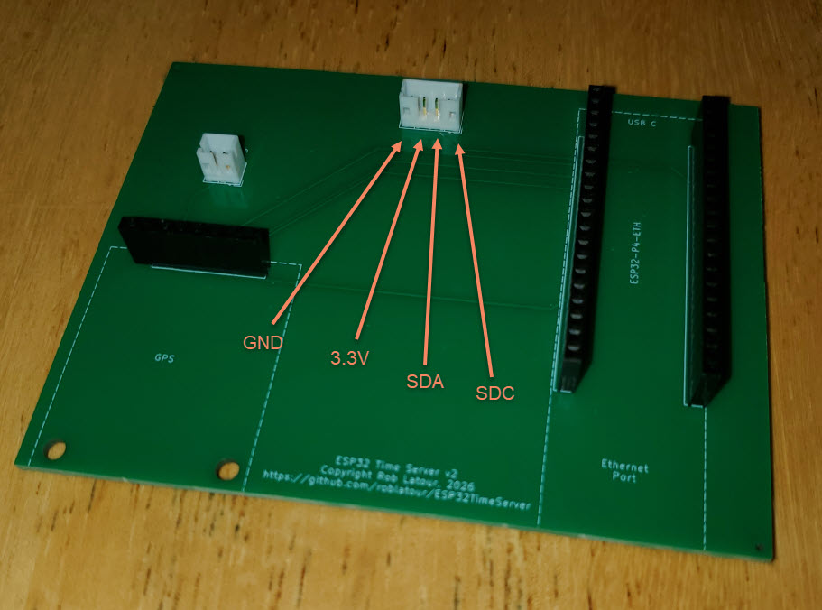

This folder and its sub-folders contain the KiCad files used to create the ESP32 Time Server's PCB.

The BOM components part numbers needed to order this board via JLCPBC are as follows:
| Item                           | Qty | JLCPCB Part Number | Url                                                                |
| ------------------------------ | --- | ------------------ | ------------------------------------------------------------------ |
| 20 pin socket for ESP32-P4-ETH | 2   | C2905423           | https://jlcpcb.com/partdetail/3175197-KH_2_54FH_1X20P_H85/C2905423 |
| 8 pin socket for GPS           | 1   | C2905417           | https://jlcpcb.com/partdetail/3175191-KH_2_54FH_1X8P_H85/C2905417  |
| connector for LCD:             | 1   | C566011            | https://jlcpcb.com/partdetail/JST-B4B_PH_K_SGW/C566011             |
| connector for button:          | 1   | C5251182           | https://jlcpcb.com/partdetail/JST-B2B_PH_K_SGW/C5251182            |
   

 Note: When I designed the board I didn't think to label the pins for the LCD connector on the board. 
If I ever need more boards I'll fix this, but for now the photo of the board below has edited onto it the missing pin markings:

Also, when looking at the other photos of the PCB with the components (below) don't let colour of the wires of the LCD connector cable confuse you.  Ideally they would have been coloured differently.  However, I had that pre-wired cable connector on hand and I just used it. 

The pin markings for the external button connector don't matter, as either pin can be connected to either terminal of the external button. 

