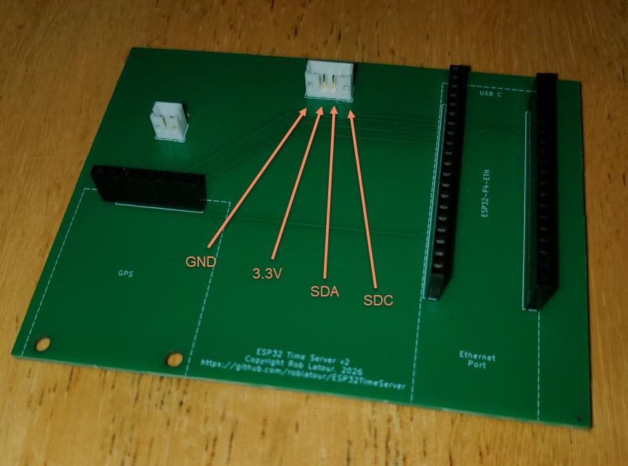

# KiCad PCB Files for ESP32 Time Server

This folder and its sub-folders contain the KiCad files used to create the
ESP32 Time Server's PCB.

> **Important:**
>
> **This PCB is only compatible when using the RX, TX, and PPS pin
> configurations used in the ESP32TimeServer v2.3.1 software and earlier.**
>
> In version 2.4, the RX, TX, and PPS pin configurations were changed for
> better forward and backward compatibility between revisions of the ESP32-P4
> chip.
>
> In version 2.3.1 and earlier, the following were used:
>
> - ESP32-P4-ETH GPIO16 (TX) connected to the GPS RX pin
> - ESP32-P4-ETH GPIO17 (RX) connected to the GPS TX pin
> - ESP32-P4-ETH GPIO18 connected to the GPS PPS pin
>
> In version 2.4, the pin configurations have been changed to:
>
> - ESP32-P4-ETH GPIO22 (TX) connected to the GPS RX pin
> - ESP32-P4-ETH GPIO21 (RX) connected to the GPS TX pin
> - ESP32-P4-ETH GPIO20 connected to the GPS PPS pin
>
> However, if your setup is running fine in version 2.4 and beyond with the
> original GPIO16, 17, and 18 pin selections, this PCB will still work as long
> as the setting files specify the older pin usage.
>
> If a newer version of the PCB is developed to use the new pins, it will
> eventually be posted here.

The BOM components part numbers needed to order this board via JLCPBC are as follows:

<!-- markdownlint-disable no-bare-urls line-length -->
| Item                           | Qty | JLCPCB Part Number | Url                                                                |
| ------------------------------ | --- | ------------------ | ------------------------------------------------------------------ |
| 20 pin socket for ESP32-P4-ETH | 2   | C2905423           | https://jlcpcb.com/partdetail/3175197-KH_2_54FH_1X20P_H85/C2905423 |
| 8 pin socket for GPS           | 1   | C2905417           | https://jlcpcb.com/partdetail/3175191-KH_2_54FH_1X8P_H85/C2905417  |
| connector for LCD:             | 1   | C566011            | https://jlcpcb.com/partdetail/JST-B4B_PH_K_SGW/C566011             |
| connector for button:          | 1   | C5251182           | https://jlcpcb.com/partdetail/JST-B2B_PH_K_SGW/C5251182            |
<!-- markdownlint-enable no-bare-urls line-length -->

Note: When I designed the board I didn't think to label the pins for the LCD
connector on the board.

If I ever need more boards I'll fix this, but for now the photo of the board
below has edited onto it the missing pin markings:

Also, when looking at the other photos of the PCB with the components (below)
don't let colour of the wires of the LCD connector cable confuse you.  Ideally
they would have been coloured differently.  However, I had that pre-wired cable
connector on hand and I just used it.

The pin markings for the external button connector don't matter, as either pin
can be connected to either terminal of the external button.

